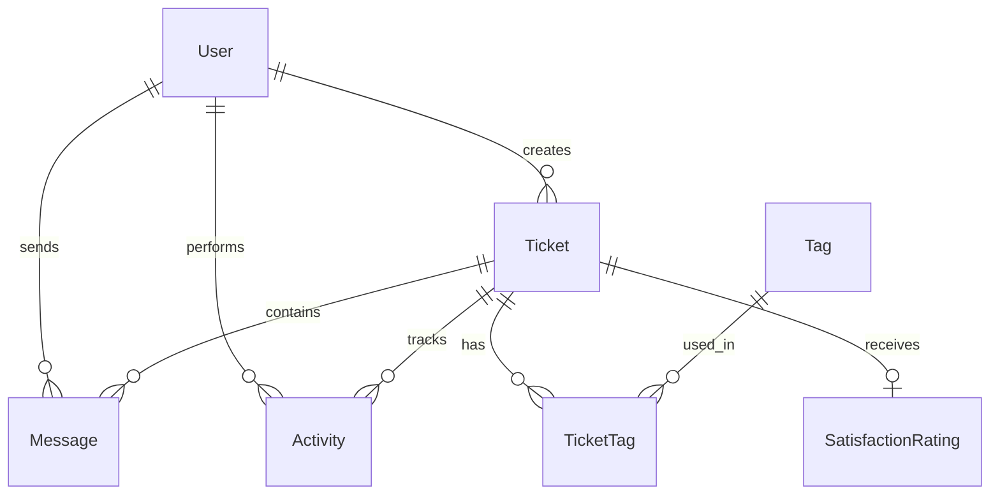

<div align="center">

# 🤖 AutoChat

### AI-Powered Customer Support Dashboard

[](https://nextjs.org/)
[](https://www.typescriptlang.org/)
[](https://tailwindcss.com/)
[](https://supabase.com/)
[](https://www.prisma.io/)

**A modern, intelligent customer support platform built with Atomic Design principles**

[Features](#-features) • [Demo](#-demo) • [Tech Stack](#-tech-stack) • [Getting Started](#-getting-started) • [Architecture](#-architecture)


</div>

---

## 🌟 Overview

AutoChat is a cutting-edge customer support dashboard that leverages artificial intelligence to enhance agent productivity and customer satisfaction. Built following **Atomic Design principles**, the application features a highly maintainable and scalable component architecture.

### Why AutoChat?

| Traditional Support | AutoChat |
|---------------------|----------|
| ❌ Manual ticket routing | ✅ AI-powered auto-routing |
| ❌ Slow response times | ✅ Instant AI suggestions |
| ❌ No sentiment tracking | ✅ Real-time sentiment analysis |
| ❌ Complex interfaces | ✅ Clean, intuitive design |
| ❌ Expensive AI add-ons | ✅ Free built-in AI features |

---

## ✨ Features

### 🎯 Core Features

<table>
<tr>
<td width="50%">

#### 📊 Intelligent Dashboard
- Real-time KPI metrics
- Ticket distribution charts
- Agent workload visualization
- Performance trend analysis

</td>
<td width="50%">

#### 🎫 Smart Ticket Management
- AI-powered classification
- Priority auto-detection
- SLA breach alerts
- Custom tags & categories

</td>
</tr>
<tr>
<td width="50%">

#### 💬 AI Response Assistant
- Contextual reply suggestions
- One-click response insertion
- Sentiment-aware recommendations
- Multi-language support ready

</td>
<td width="50%">

#### 😊 Customer Insights
- Real-time sentiment analysis
- CSAT score tracking
- Customer history timeline
- Mood change detection

</td>
</tr>
</table>

### 🚀 AI Capabilities

| Feature | Description | Status |
|---------|-------------|--------|
| **Response Suggestions** | AI-generated reply options based on context | ✅ Implemented |
| **Sentiment Analysis** | Real-time mood detection from messages | ✅ Implemented |
| **Ticket Classification** | Auto-categorize incoming tickets | ✅ Implemented |
| **Conversation Summary** | AI-generated thread summaries | 🔄 Planned |
| **Article Recommendations** | Suggest knowledge base articles | 🔄 Planned |

### 🎨 Design System

Built with **Atomic Design** methodology for maximum reusability:

```
├── Atoms (8)     → Basic UI elements (Badge, Avatar, Icon)
├── Molecules (6) → Simple combinations (SearchBar, MetricCard)
├── Organisms (7) → Complex components (TicketList, Sidebar)
├── Templates     → Page layouts
└── Pages         → Complete views
```

---

## 🛠 Tech Stack

### Frontend
| Technology | Purpose |
|------------|---------|
|  | React framework with App Router |
|  | Type-safe JavaScript |
|  | Utility-first CSS |
|  | Component library |
|  | State management |
|  | Animations |

### Backend
| Technology | Purpose |
|------------|---------|
|  | Database ORM |
|  | PostgreSQL + Realtime |
|  | AI/LLM integration |

---

## 🚦 Getting Started

### Prerequisites

- Node.js 18+
- Bun or npm
- Supabase account

### Installation

1. **Clone the repository**
```bash
git clone https://github.com/abbayosua/AutoChat.git
cd AutoChat
```

2. **Install dependencies**
```bash
bun install
# or
npm install
```

3. **Set up environment variables**
```bash
cp .env.example .env
```

Edit `.env` with your Supabase credentials:
```env
DATABASE_URL="postgresql://..."
DIRECT_URL="postgresql://..."
SUPABASE_URL="https://your-project.supabase.co"
SUPABASE_ANON_KEY="your-anon-key"
SUPABASE_SERVICE_ROLE_KEY="your-service-role-key"
```

4. **Initialize the database**
```bash
bun run db:push
```

5. **Start the development server**
```bash
bun run dev
```

Open [http://localhost:3000](http://localhost:3000) in your browser.

---

## 📁 Project Structure

```
src/
├── app/                    # Next.js App Router
│   ├── api/               # API Routes
│   │   ├── tickets/       # Ticket CRUD
│   │   ├── dashboard/     # Metrics endpoint
│   │   └── ai/            # AI features
│   ├── layout.tsx         # Root layout
│   └── page.tsx           # Dashboard page
│
├── components/            # Atomic Design Structure
│   ├── atoms/            # Basic building blocks
│   │   ├── status-badge.tsx
│   │   ├── priority-badge.tsx
│   │   ├── avatar-with-status.tsx
│   │   ├── ai-indicator.tsx
│   │   ├── sentiment-badge.tsx
│   │   ├── csat-stars.tsx
│   │   ├── timer-display.tsx
│   │   └── tag-badge.tsx
│   │
│   ├── molecules/        # Simple combinations
│   │   ├── metric-card.tsx
│   │   ├── search-bar.tsx
│   │   ├── ticket-list-item.tsx
│   │   ├── message-bubble.tsx
│   │   ├── quick-action-button.tsx
│   │   └── notification-item.tsx
│   │
│   ├── organisms/        # Complex components
│   │   ├── sidebar-nav.tsx
│   │   ├── header-bar.tsx
│   │   ├── ticket-list.tsx
│   │   ├── metrics-grid.tsx
│   │   ├── response-suggestions.tsx
│   │   ├── activity-timeline.tsx
│   │   └── customer-profile.tsx
│   │
│   ├── templates/        # Page layouts
│   └── ui/               # shadcn/ui components
│
├── lib/                   # Utilities
│   ├── db.ts             # Prisma client
│   └── utils.ts          # Helper functions
│
├── types/                 # TypeScript types
│   └── index.ts
│
└── prisma/               # Database schema
    └── schema.prisma
```

---

## 🎨 Color System

AutoChat uses a carefully crafted color palette (no blue/indigo as per design guidelines):

| Color | Hex | Usage |
|-------|-----|-------|
| 🔵 **Teal** | `#0D9488` | Primary actions, active states |
| 🟢 **Emerald** | `#059669` | Success, resolved status |
| 🟡 **Amber** | `#D97706` | Warnings, pending status |
| 🔴 **Rose** | `#E11D48` | Errors, urgent priority |
| 🟣 **Violet** | `#7C3AED` | AI features, suggestions |

---

## 📊 Database Schema



### Key Models

| Model | Description |
|-------|-------------|
| **User** | Customers, agents, and admins |
| **Ticket** | Support tickets with AI analysis |
| **Message** | Conversation threads |
| **Activity** | Timeline events |
| **Tag** | Custom categorization |
| **SatisfactionRating** | CSAT feedback |

---

## 🔌 API Endpoints

### Tickets
```http
GET    /api/tickets          # List tickets with filters
POST   /api/tickets          # Create new ticket
GET    /api/tickets/:id      # Get ticket details
PATCH  /api/tickets/:id      # Update ticket
```

### Dashboard
```http
GET    /api/dashboard/metrics    # Get KPI metrics
```

### AI Features
```http
POST   /api/ai/suggest-response     # Get AI suggestions
POST   /api/ai/analyze-sentiment    # Analyze sentiment
```

---

## 🧪 Competitive Analysis

Compared to industry leaders:

| Feature | Zendesk | Intercom | Freshdesk | **AutoChat** |
|---------|---------|----------|-----------|--------------|
| AI Response Suggestions | ✅ | ✅ | ✅ | ✅ |
| Sentiment Analysis | ✅ | ✅ | ✅ | ✅ |
| Real-time Updates | ✅ | ✅ | ✅ | ✅ |
| Embed-able Widget | ✅ | ✅ | ✅ | ✅ |
| Free AI Features | ❌ | ❌ | ⚠️ Limited | ✅ |
| Open Source | ❌ | ❌ | ❌ | ✅ |

---

## 🗺 Roadmap

### Phase 1: Foundation ✅
- [x] Atomic design components
- [x] Ticket management
- [x] Dashboard metrics
- [x] AI response suggestions
- [x] Sentiment analysis

### Phase 2: Enhancement 🔄
- [ ] Supabase Realtime integration
- [ ] Live chat widget
- [ ] Canned responses
- [ ] Internal notes
- [ ] CSAT surveys

### Phase 3: Advanced 🎯
- [ ] Knowledge base
- [ ] Article recommendations
- [ ] Conversation summaries
- [ ] Workload distribution
- [ ] Advanced analytics

---

## 🤝 Contributing

Contributions are welcome! Please feel free to submit a Pull Request.

1. Fork the repository
2. Create your feature branch (`git checkout -b feature/AmazingFeature`)
3. Commit your changes (`git commit -m 'Add some AmazingFeature'`)
4. Push to the branch (`git push origin feature/AmazingFeature`)
5. Open a Pull Request

---

## 📄 License

This project is licensed under the MIT License - see the [LICENSE](LICENSE) file for details.

---

## 👥 Authors

- **Abba Yosua** - *Initial work* - [@abbayosua](https://github.com/abbayosua)

---

## 🙏 Acknowledgments

- [shadcn/ui](https://ui.shadcn.com/) - Beautiful component library
- [Supabase](https://supabase.com/) - Backend infrastructure
- [Prisma](https://prisma.io/) - Database toolkit
- [Lucide Icons](https://lucide.dev/) - Beautiful icons

---

<div align="center">

**Built with ❤️ by the AutoChat Team**

[⬆ Back to Top](#-autochat)

</div>
